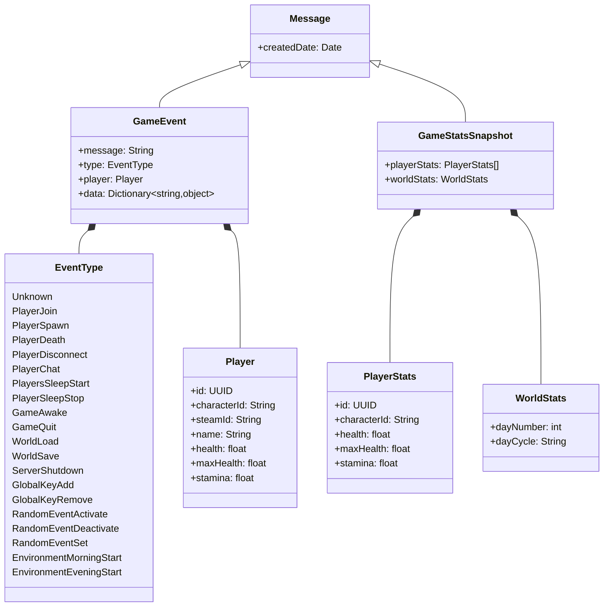

# Event types

Events are categorized into two different types:

- General game events
- Recurrent events

### General game events

These types of events signify actions or changes within the game world. They can be triggered by players' actions or by the game instance itself.
Some exemples of these include:
- Player joining a server
- Player going to sleep
- The start of the evening
- The start of a new day

Use cases for consuming game events include storing and browsing events, as well as executing custom logic when a specific event occurs, such as posting information to a Discord channel.

### Recurrent events

Recurrent events are snapshots of game statistics taken at regular intervals (defaulting to one second). These events include data regarding the current online players and various properties of the game world.  
Use cases for consuming recurrent events include user interfaces that continuously update to display current player health and stamina values.

## Diagram

